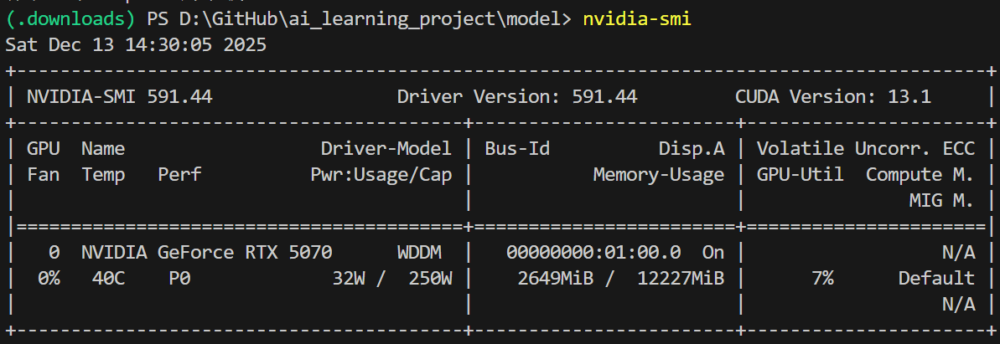

# 介绍
---
这个项目是用来搞什么ai改卷的。额，那么我来简单介绍一下

### 一.项目结构
先放一尊大佛镇一下屎山的邪气

                            _ooOoo_
                           o8888888o
                           88" . "88
                           (| -_- |)
                            O\ = /O
                        ____/`---'\____
                      .   ' \\| | `.
                       / \\||| : ||| \
                     / _||||| -:- |||||- \
                       | | \\\ - / | |
                     | \_| ''\---/'' | |
                      \ .-\__ `-` ___/-. /
                   ___`. .' /--.--\ `. . __
                ."" '< `.___\_<|>_/___.' >'"".
               | | : `- \`.;`\ _ /`;.`/ - ` : | |
                 \ \ `-. \_ __\ /__ _/ .-` / /
         ======`-.____`-.___\_____/___.-`____.-'======
                            `=---='

         .............................................
                  佛祖镇楼                  BUG辟易
          佛曰:
                  写字楼里写字间，写字间里程序员；
                  程序人员写程序，又拿程序换酒钱。
                  酒醒只在网上坐，酒醉还来网下眠；
                  酒醉酒醒日复日，网上网下年复年。
                  但愿老死电脑间，不愿鞠躬老板前；
                  奔驰宝马贵者趣，公交自行程序员。
                  别人笑我忒疯癫，我笑自己命太贱；
                  不见满街漂亮妹，哪个归得程序员？

好的，接下来正经的介绍一下

>注意，生成试卷的东西在这里[试卷生成器](https://github.com/EnderBoy666/ai_learning_project/tree/main/create_exam)，可以去查看那里的README.md哈。

首先呢，这个项目分为三个主要部分

第一个，是文字识别（尚在编写），用于给第二阶段提供数据

接下来，就是第二部分：使用deepseek对传入的数据进行分析和批改。（或者自己下别的模型）

* 经过我严谨的测试，在cpu（intel Xeon W-11955M)和16G ddr4内存上运行最低配的模型（1.5b）上历时仅仅两节课的时间就给出了分析，尽管只有256的字数上限

嗯对，第三部分。另一个ai（尚在寻找）对第二阶段传入的数据进行格式的编写和模板矫正，给出文档和ppt

## 二、使用方法
再放一尊佛
```
/**
 * _ooOoo_
 * o8888888o
 * 88" . "88
 * (| -_- |)
 *  O\ = /O
 * ___/`---'\____
 * .   ' \\| |// `.
 * / \\||| : |||// \
 * / _||||| -:- |||||- \
 * | | \\\ - /// | |
 * | \_| ''\---/'' | |
 * \ .-\__ `-` ___/-. /
 * ___`. .' /--.--\ `. . __
 * ."" '< `.___\_<|>_/___.' >'"".
 * | | : `- \`.;`\ _ /`;.`/ - ` : | |
 * \ \ `-. \_ __\ /__ _/ .-` / /
 * ======`-.____`-.___\_____/___.-`____.-'======
 * `=---='
 *          .............................................
 *           佛曰：bug泛滥，我已瘫痪！
```
##### *目前项目还没写完，所以部署方法可能会不断更新*
1. 首先你需要先新建一个虚拟环境
```py
python -m venv .venv
```
2. 然后进入虚拟环境
```py
.\.venv\Scripts\activate
```
3. 安装依赖包
```py
pip install -r requirements.txt
```
**注意，你需要手动寻找适合的torch版本。如果你不是nvidia显卡，请使用cpu或别的版本的pytorch。**

具体的，先在命令行中输入nvdia-smi
```py
nvidia-smi
```
然后你会得到类似下图的输出：

右上角的，是你的显卡支持的最大cuda版本
接下来，来到[pytorch](https://pytorch.org/get-started/locally/),选择合适的版本，复制下面的命令来到刚刚的虚拟环境中运行。例如：
```bash
pip3 install torch torchvision --index-url https://download.pytorch.org/whl/cu130
```
*如果下载过慢，可以把链接替换为https://mirrors.nju.edu.cn/pytorch/whl/cu130*
>又及，本项目的手写识别的训练（就那两个trai,py）使用的是EMNIST与MNIST数据集，如需训练自行下载后放入）

4. 安装模型，此时请移步至model文件夹内，按照其中的README.md进行操作。在这里不再过多赘述

5. 在虚拟环境中,运行main.py文件。
```py
python main.py
```
之后，将会弹出一个网站，按照指引进行操作即可